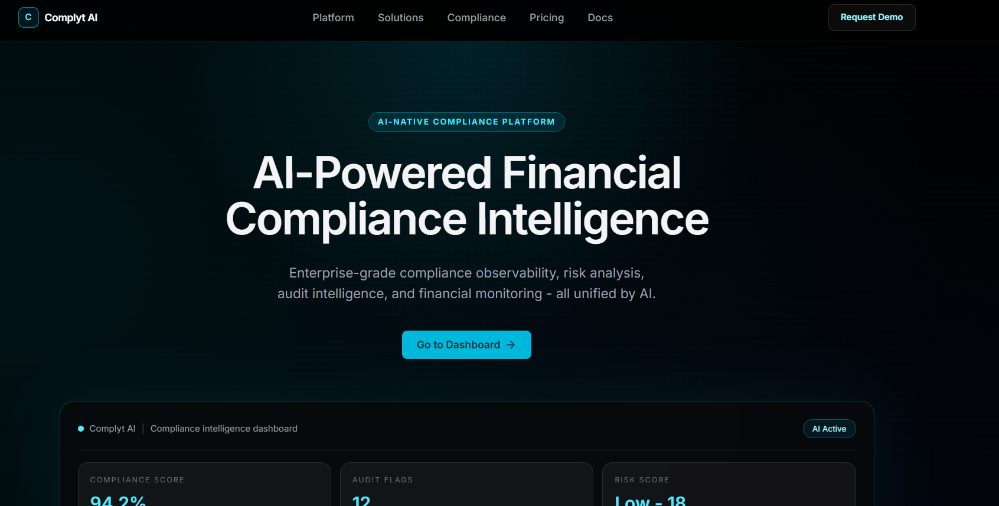
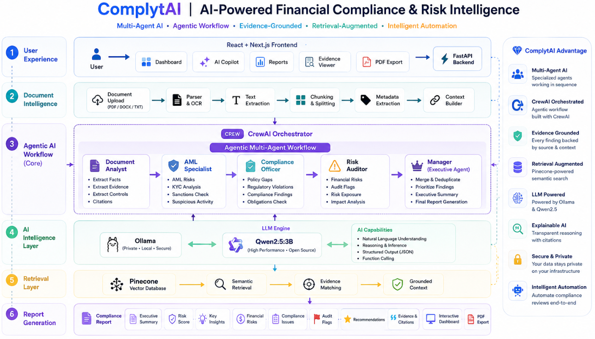
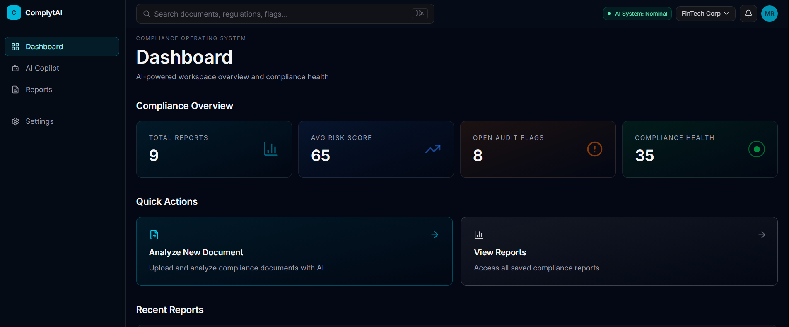
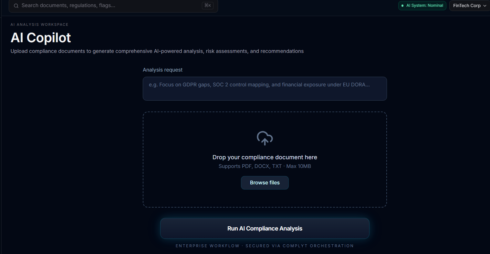
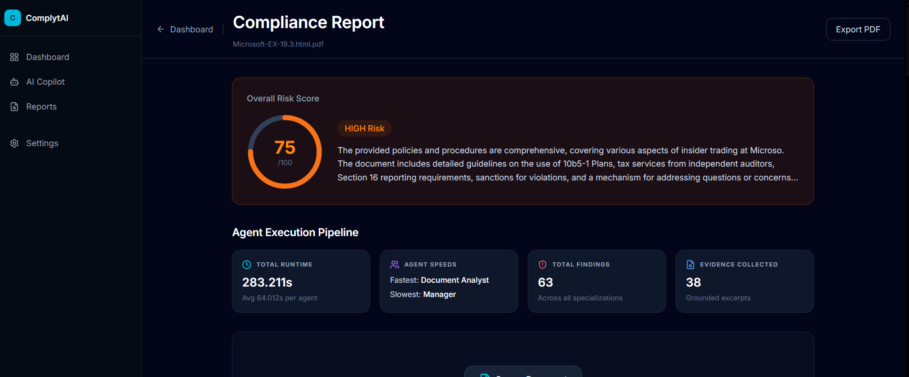
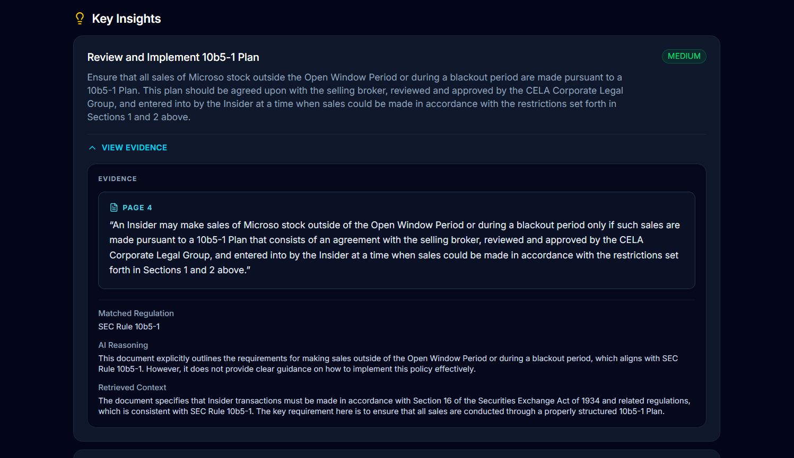
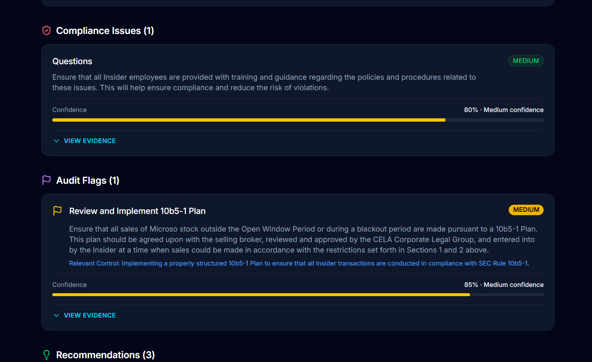

# 🛡️ ComplytAI

### Agentic AI-Powered Financial Compliance & Risk Intelligence Platform

An evidence-grounded **Agentic Multi-Agent AI** platform that transforms complex financial and regulatory documents into actionable compliance insights, risk assessments, and executive-ready reports using specialized AI agents and Retrieval-Augmented Generation (RAG).

<p align="center">

**Agentic AI** • **Multi-Agent AI** • **CrewAI** • **RAG** • **FastAPI** • **Next.js** • **Ollama** • **Qwen2.5** • **Pinecone**

</p>

---

# 📌 Overview

Financial compliance reviews are often manual, time-consuming, and require expertise across multiple regulatory domains.

ComplytAI automates this workflow through an **Agentic Multi-Agent AI system**, where specialized AI agents independently analyze uploaded financial documents before collaboratively producing an evidence-grounded executive compliance report.

Rather than relying on a single LLM response, ComplytAI decomposes the problem into specialized reasoning tasks, enabling more structured, explainable, and transparent compliance analysis.

---

# 🚀 Platform

<p align="center">

</p>

---

# 🎯 AI Engineering Highlights

✅ Agentic AI Architecture

✅ Multi-Agent Workflow using CrewAI

✅ Retrieval-Augmented Generation (RAG)

✅ Evidence-Grounded Reasoning

✅ Structured Pydantic Outputs

✅ Financial Risk Intelligence

✅ Regulatory Compliance Analysis

✅ Executive PDF Report Generation

---

# 🏗 Architecture

<p align="center">

</p>

ComplytAI follows a layered **Agentic AI architecture**, where independent AI specialists analyze different dimensions of financial compliance before synthesizing a single executive report.

---

# ⚙️ Multi-Agent Workflow

```text
                Upload Financial Document
                           │
                           ▼
                Document Processing Layer
      (Parsing • Chunking • Context Building)
                           │
                           ▼
                 CrewAI Agent Orchestrator
                           │
      ┌──────────────────────────────────────────────┐
      │                                              │
      ▼                                              ▼
Document Analyst ─────────► AML Specialist
      │                                              │
      ▼                                              ▼
Compliance Officer ───────► Risk Auditor
      │
      ▼
 Manager (Executive Report Synthesis)
      │
      ▼
 Evidence-Grounded Compliance Report
```

### Agent Responsibilities

| Agent | Responsibility |
|--------|----------------|
| 📄 Document Analyst | Extract document facts, controls, evidence and citations |
| 🛡 AML Specialist | Detect AML, KYC, sanctions and suspicious activity risks |
| ⚖ Compliance Officer | Identify compliance gaps and regulatory violations |
| 📊 Risk Auditor | Evaluate financial exposure, audit risks and control failures |
| 👨‍💼 Manager | Merge findings, prioritize risks and generate the executive report |

---

# ✨ Features

## 🤖 Agentic AI Workflow

Specialized AI agents collaborate to solve different compliance tasks before producing a unified report.

---

## 🔍 Evidence-Grounded Analysis

Every finding is backed by supporting document evidence and retrieved context.

---

## 📚 Retrieval-Augmented Generation (RAG)

Semantic retrieval improves factual grounding and reduces unsupported responses.

---

## 📊 Executive Compliance Reports

Automatically generates:

- Executive Summary
- Risk Score
- Confidence Score
- Financial Risks
- Compliance Issues
- Audit Flags
- Recommendations

---

## 📑 Explainable AI

Every recommendation includes supporting evidence, citations, retrieved context and reasoning.

---

## 📈 Interactive Dashboard

Analyze reports through a modern dashboard with confidence scores, evidence explorer and report history.

---

# 📸 Screenshots

## Dashboard

<p align="center">

</p>

---

## AI Copilot

<p align="center">

</p>

---

## Compliance Report

<p align="center">

</p>

---

## Key Insights & Evidence

<p align="center">

</p>

---

## Financial Risk Analysis

<p align="center">

</p>

---

# 💻 Technology Stack

### Frontend

- React
- Next.js
- TypeScript
- TailwindCSS

### Backend

- Python
- FastAPI
- CrewAI

### AI

- Agentic AI
- Multi-Agent AI
- CrewAI
- Ollama
- Pydantic Structured Outputs
- Evidence-Grounded Reasoning
- Reflection-Based Reasoning
- AI Workflow Orchestration
- Prompt Engineering
- Context Engineering
- JSON Schema Validation
- Confidence Scoring
- Explainable AI (XAI)


### Retrieval

- Pinecone
- Vector Search
- Retrieval-Augmented Generation (RAG)

### Output

- Interactive Dashboard
- Executive Compliance Report
- PDF Export

---

# 🧠 Engineering Learnings

Building ComplytAI was not just about integrating an LLM—it was about designing a complete AI system capable of reliable, explainable, and modular reasoning.

### Agentic System Design

- Designed a role-based multi-agent architecture where each agent specializes in a distinct compliance domain.
- Learned how task decomposition improves maintainability, modularity, and reasoning quality compared to monolithic prompts.

### AI Workflow Orchestration

- Built sequential CrewAI workflows with inter-agent context passing.
- Structured task dependencies to enable collaborative reasoning across agents.

### Retrieval-Augmented Generation

- Implemented semantic retrieval to ground AI responses with relevant document context.
- Reduced unsupported outputs by incorporating evidence before reasoning.

### Structured AI Outputs

- Used Pydantic models to enforce deterministic JSON responses.
- Improved downstream rendering reliability through schema validation.

### AI Systems Engineering

- Designed an end-to-end AI pipeline connecting document ingestion, orchestration, retrieval, reasoning, and report generation.
- Optimized prompts, context management, and structured outputs for local LLM inference.

### Explainability

- Built evidence-backed findings with confidence scores, citations, and retrieved context.
- Prioritized transparency to make AI decisions auditable.

---

# 🚀 Future Roadmap

- Parallel Agent Execution
- Reflection Pipeline
- Guardrail Validation
- Regulatory Knowledge Graph
- Multi-document Analysis
- Human-in-the-loop Review
- Streaming Agent Responses
- Enterprise Authentication

---

# ⭐ Why ComplytAI?

ComplytAI showcases modern AI engineering practices by combining **Agentic AI**, **Multi-Agent Orchestration**, **Retrieval-Augmented Generation**, and **Evidence-Grounded Reasoning** into a production-style compliance intelligence platform.

Rather than treating an LLM as a chatbot, the system demonstrates how specialized AI agents can collaborate through structured workflows to solve complex financial compliance tasks while producing transparent, explainable, and enterprise-ready outputs.